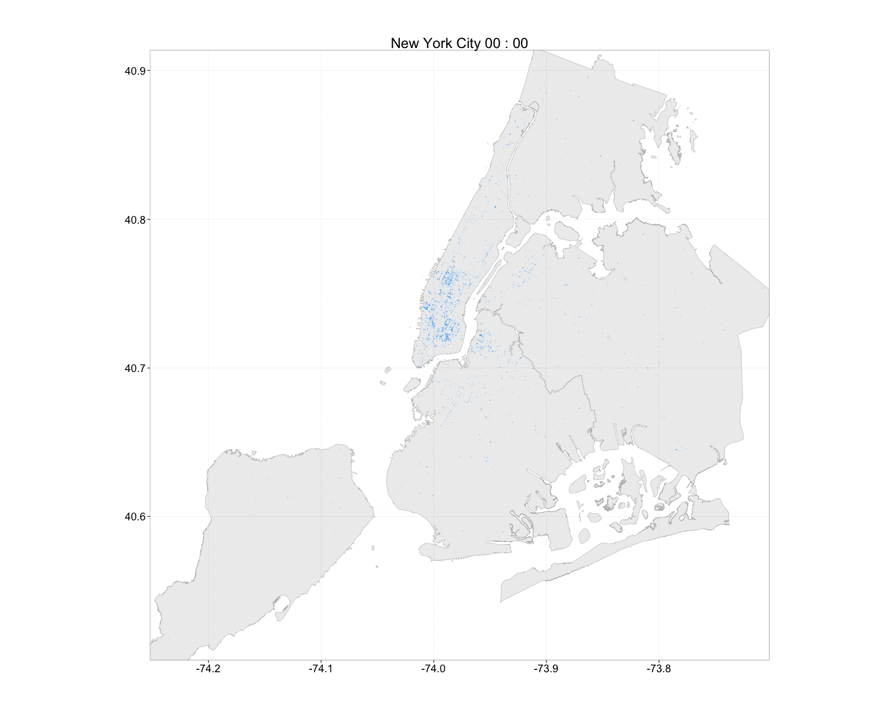
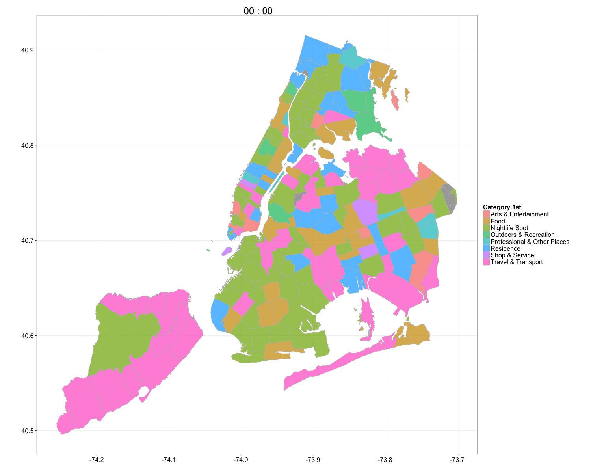

```{r,echo=FALSE,include=FALSE}
library(rgeos)
library(scales)
library(reshape2)
library(ggplot2)
library(gridExtra)
#library(TSA)
library(ca)

source("../../global/functions/prepare.checkin.R")
source("../../global/functions/basic.stats.plots.R")
source("../../global/functions/spatial.analysis.R")
source("../../global/functions/etc.R")

# global variable
ppi=300

crs.wgs84.str = "+proj=longlat +datum=WGS84 +no_defs +ellps=WGS84 +towgs84=0,0,0"

```

First, we load the data into the workspace. 

```{r,echo=FALSE}
# checkin.NY = prepare.checkin("../../global/data/csv-raw/NewYorkCity.csv",
#                              is.raw=TRUE, 
#                              weather.data="../../global/data/csv-raw/Weather_NY.csv", 
#                              convert.time=TRUE, add.history=TRUE)
# save(checkin.NY,file="../../global/data/Rda-saved/checkin.global.weather.NY.Rda")
load(file="../../global/data/Rda-saved/checkin.global.weather.NY.Rda")
```

Following is a summary of the dataset.

```{r}
summary(checkin.NY)
```


### 1. Exploratory analysis 

#### Temporal: Frequency domain

 

```{r}
freq.plot(checkin.NY,title="New York City")
```

The analysis in the frequency domain reveals a strong harmonics with a period 
of 24 hours. Therefore, it is reasonable to analyze the data by 24 hours.

#### Temproal: Time domain 

The distribution of the check-in categories accross one period (24 hours).

```{r}
time.distribution.plot(checkin.NY,title="New York City")
```

#### Temporal: Radial plot

The distribution of the check-in categories in 24 hours in radial plots.

```{r}
time.radial.plot(checkin.NY)
```

### Spatial

have a look at a intuitive spatiotemporal visualizaiton of the data...

```{r,eval=FALSE}
basemap = map.plot("../../global/data/shapefiles", 
                   "NYC_borough_boundaries_WGS84",
                   alpha=0.1,size=0.3,color="grey")

saveGIF({
  point.animation.plot(checkin.NY, more.aes=aes(color=cate_l1),
                       basemap=basemap, size=3, title="New York City")
}, interval = 0.5, movie.name = "spatiotemporal.gif", 
ani.width = 1500, ani.height = 1200)


```



What will the statistics say when we neglect the temporal factors?
First of all, if we try to find spatial clusters 
based on differnt checkin categories, the distribution of the founded clusters
are quite differnt. It indicates that each category has differnt correlations
with the geographic space.

```{r}
if(!exists("basemap")){
    basemap <- map.plot("../../global/data/shapefiles", 
                   "NYC_borough_boundaries_WGS84",
                   alpha=0.1,size=0.3,color="grey")
}

plots <- lapply(split(checkin.NY,checkin.NY$cate_l1),function(ci){
    # find out clusters for the type of category
    clusters = spatial.clustering(ci)
    
    centers = clusters[["centers"]]
    points = clusters[["point.unique"]]
    wss = clusters[["wss"]]
    pct = clusters[["pct"]]
    lbl = paste(nrow(centers),"clusters;\nWSS:",
                  formatC(wss,digits=2,format="f"),
                  "(",format.percent(pct),")")
    
    # add basic points
    gg.map <- point.plot(points,x="lon.x",y="lat.x",alpha=0.05, basemap=basemap)
    
    # add cluster information
    gg.map <- point.plot(centers, x="lon.center",y="lat.center",
                         more.aes = aes(color=cid.ordered),
                         basemap=gg.map,
                         xlim=range(checkin.NY$lon,finite=TRUE),
                         ylim=range(checkin.NY$lat,finite=TRUE),
                         size = log(centers$size,5),alpha = 0.7)
    
    # some plot configuration
    gg.map <- gg.map + ggtitle(ci[1,"cate_l1"]) +
        theme(legend.position="none") + 
        geom_text(aes(x = -74.13, y = 40.87), label = lbl, size=2) 
    
})


# png("categorized_clustering.png",width=15*ppi,height=6*ppi,res=ppi)
# grid.arrange(plots[[1]],plots[[2]],plots[[3]],plots[[4]],
#              plots[[5]],plots[[6]],plots[[7]],plots[[8]], 
#              plots[[9]],plots[[10]],nrow=4, ncol=3)
# dev.off()

plots[[1]];plots[[2]];plots[[3]];plots[[4]];plots[[5]];plots[[6]];plots[[7]];plots[[8]]; plots[[9]];plots[[10]]
```

We could also see the most domimant categories in each part of the entire city.

```{r}

# plot the map, and each polygon is filled with its dominant category
# SPDF: a SpatialPolygonDataFrame, which should include the information for 
# filling options

# prepare polygon data
SPDF = readOGR(dsn = "../../global/data/shapefiles", layer = "NYC_zipcode")
# classify the polygons in the SPDF by the overlapped point data, 
# and convert the result to normal R dataframe for plotting
mapdf=df.from.spdf(classify.polygon.by.point(point=checkin.NY, 
                                             SPDF, clsfy.attr="cate_l1"))
        # mapdf$density=apply(mapdf,1,function(i){i[i["cate.dom"]]})
        # mapdf$density=as.numeric(formatC(mapdf$density,digits=1,format = "f"))

map.plot(mapdf = mapdf, more.aes = aes(fill=Category.1st),
         color="grey",size=0.3,alpha=0.7)+
    xlab("")+ylab("")


```

Such map can also be visualized with time to show the impact of both time and
space...

```{r}

saveGIF({
  map.animation.plot(point=checkin.NY,SPDF,more.aes=aes(fill=Category.1st),
                     color="grey",size=0.3,alpha=0.7)
}, interval = 0.5, movie.name = "cateogrized.polygon.spatiotemporal.gif", 
ani.width = 1500, ani.height = 1200)

```


### Meteorological: Correspondence analysis

```{r}
cate.conds = xtabs(~conds+cate_l2, data=checkin.NY)
#prop.table(cate.conds, 1) # row percentages
#prop.table(cate.conds, 2) # column percentages
fit <- ca(cate.conds)
#print(fit) # basic results
summary(fit) # extended results
#plot(fit) # symmetric map
plot(fit, mass = TRUE, contrib = "absolute", map ="rowgreen", 
     arrows = c(TRUE, FALSE)) # asymmetric map

```


### 3. Model -  derivation and corresponding functions

Under the assumption $H=i$ is independent from $W=j$
$$P(C=k|H=i,W=j)=\frac{P(C=k,H=i,W=j)}{P(H=i,W=j)}=\frac{P(H=i,W=j|C=k)*P(C=k)}{P(H=i)*P(W=j)}  (1) $$ 


since $H=i$ is independent from $W=j$,
$$Exp[P(H=i,W=j|C=k)]=P(H=i|C=k)*P(W=j|C=k)  (2)$$

therefore, 
$$Exp[P(C=k|H=i,W=j)]=Exp[ \frac{P(H=i,W=j|C=k)*P(C=k)} {P(H=i)*P(W=j)}] \\\
=\frac{P(H=i|C=k)*P(W=j|C=k)*P(C=k)}{P(H=i)*P(W=j)} \\\
=\frac{\frac{P(H=i,C=k)}{P(C=k)}*\frac{P(W=j,C=k)}{P(C=k)}*P(C=k)}{P(H=i)*P(W=j)} \\\
=\frac{P(C=k|H=i)*P(H=i)*P(C=k|W=j)*P(W=j)}{P(H=i)*P(W=j)*P(C=k)} \\\
=\frac{P(C=k|H=i)*P(C=k|W=j)}{P(C=k)} (3)$$

* relevance contextualized by temporal factor 

$$P_{u}(C=k|H=i)=\frac{\Phi_{u}(C=k,H=i)}{\Phi_{u} (H=i)} (4)$$

```{r}
get.temporal.impact <- function(dataframe){
    
    hours = formatC(c(0:23),width=2,flag="0")
    
    list.pr = lapply(hours, function(hour){
        data.in.hour = dataframe[dataframe$hour==hour,]
        freq.tab = as.data.frame(table(data.in.hour$cate_l2))
        freq.df = data.frame(t(freq.tab$Freq / sum(freq.tab$Freq) ))
        colnames(freq.df) = freq.tab$Var1
        
        freq.df
    })
    
    do.call(rbind,list.pr)
#     dataframe.in.hour = dataframe[which(dataframe$hour==hour),]
#     phi.h = nrow(dataframe.in.hour)
#     
#     list.category = split(dataframe.in.hour, dataframe.in.hour$cate_l2)
#     sapply(list.category, function(i){
#         nrow(i)/phi.h
#     })
}


```


* relevance contextualized by spatial factor
```{r}
checkin.in.poly = point.in.poly(checkin.NY, SPDF, copy.attr="POSTAL")
get.spatial.impact <- function(checkin.in.poly, 
                               poly.attr="POSTAL",cate.attr="cate_l2"){
    mat = cate.distr.in.poly(checkin.in.poly, poly.attr=poly.attr,cate.attr=cate.attr)
    mat[,1:(ncol(mat)-4)]
}

```


* relevance contextualized by (unweighted meteorological) factor 

$$P_{u}(C=k|W=j)=\frac{Intercept(C=k,W=j)}{\sum Intercept(C,W=j)} (5)$$

```{r}
get.meteorological.impact <- function(fit){
    
    conds = fit[["rownames"]]
    
    pr.list = lapply(conds, function(cond){
        conds.id = which(fit[["rownames"]]==conds)
        ref.vec = fit[["rowcoord"]][conds.id,1:8]
        cate.all = fit[["colcoord"]][,1:8]
        
        intercepts = apply(cate.all, 1, function(x){ 
        (x[1]*ref.vec[1] + x[2]*ref.vec[2] + x[3]*ref.vec[3] + x[4]*ref.vec[4] +
             x[5]*ref.vec[5] + x[6]*ref.vec[6] + x[7]*ref.vec[7] + x[8]*ref.vec[8] ) /
            (ref.vec[1]^2 + ref.vec[2]^2 + ref.vec[3]^2 + ref.vec[4]^2 +
                 ref.vec[5]^2 + ref.vec[6]^2 + ref.vec[7]^2 + ref.vec[8]^2 ) 
        } )
        
        # vec = intercepts / sum(intercepts)  !!!wrong!!! intercetp can be negative
        # scale into [0,1]
        vec = (intercepts - min(intercepts)) / (max(intercepts)-min(intercepts)) 

        df = data.frame(t(vec))
        colnames(df) = fit[["colnames"]]
        rownames(df) = cond
        
        df
    })
    
    
    do.call(rbind,pr.list)

}

get.meteorological.impact2 <- function(dataframe,conds){
    
    dataframe.in.conds = dataframe[which(dataframe$conds==conds),]
    phi.c = nrow(dataframe.in.conds)
    
    list.category = split(dataframe.in.conds, dataframe.in.conds$cate_l2)
    sapply(list.category, function(i){
        nrow(i)/phi.c
    })
}

```


* weighted meteorological factor 

$$P_{u}^{*} (C=k|W=j)= w_{j}*[P_{u}(C=k|W=j)-\bar P_{u}]+\bar P_{u}$$

```{r}

get.weather.weight <- function(fit){
    conds.all = fit[["rowcoord"]][,1:2]
    
    mag = apply(conds.all, 1, function(x){ 
        sqrt( (x[1]^2+x[2]^2) )
        } )
    
    vec = mag / sum(mag)
    names(vec) = fit[["rownames"]]
    vec
}

get.weighted.meteorological.impact <- function(fit){
    
#     cate.conds = xtabs(~conds+cate_l2, data=dataframe)
#     fit <- ca(cate.conds)
    conds = fit[["rownames"]]
    
    unweighted = get.meteorological.impact(fit)
    weights = get.weather.weight(fit)
    
#     conds.id = which(fit[["rownames"]]==conds)
    
#     vec = weights[conds.id] * (unweighted-mean(unweighted)) + mean(unweighted)
    pr.list = lapply(conds, function(cond){
        weight = weights[cond]
        unweighted.cond = unlist(unweighted[cond,])
        vec = weight * (unweighted.cond-mean(unweighted.cond,na.rm = TRUE)) + 
            mean(unweighted.cond)
## here@!
        df = data.frame(t(vec))
        colnames(df) = fit[["colnames"]]
        rownames(df) = cond
        
        df
    })
#     vec = weight * (unweighted-mean(unweighted)) + mean(unweighted)
#     names(vec) = fit[["colnames"]]
#     
#     vec
    do.call(rbind,pr.list)
}


get.weighted.meteorological.impact2 <- function(dataframe, conds, weight){
    
    
    unweighted = get.meteorological.impact2(dataframe, conds)

    weight * (unweighted-mean(unweighted)) + mean(unweighted)
    
    
}

```

* denominator (unweighted relevance)

$$P(C=k)=\frac{\Phi_{u} (C=k) }{\Phi_{u} }$$


```{r}
get.denominator <- function(dataframe){
    
#     phi.h = nrow(dataframe)
#     
#     list.category = split(dataframe, dataframe$cate_l2)
#     denominator = sapply(list.category, function(i){
#         nrow(i)/phi.h
#     })
#     
#     denominator
    
    freq.tab = as.data.frame(table(dataframe$cate_l2))
    
    df = data.frame(t(freq.tab$Freq / sum(freq.tab$Freq)))
    colnames(df) = freq.tab$Var1
    
    df
}
```

* the final result 

$$E[P(C=k|H=i,W=j)]=\frac{P(C=k|H=i)*P(C=k|W=j)}{P(C=k)}$$

1. global 

```{r}
# global matrix
pr.t.mat = get.temporal.impact(checkin.NY)
pr.w.mat = get.weighted.meteorological.impact(fit)
pr.s.mat = get.spatial.impact(checkin.in.poly)
pr.d = unlist(get.denominator(checkin.NY))
checkin.in.poly = na.omit(checkin.in.poly)

checkin.in.poly$flag = paste(checkin.in.poly$hour,checkin.in.poly$POSTAL,
                             checkin.in.poly$conds)
counting = 0
prediction = lapply(split(checkin.in.poly, checkin.in.poly$flag),function(i){
    counting <<- nrow(i)+counting
    print(paste(Sys.time(),"processed",counting,"records."))
    
    hour = i[1,"hour"]
    conds = i[1,"conds"]
    polygon = i[1,"POSTAL"]
    
    real.list = as.character(i$cate_l2)
    
    if (!is.na(hour)) {
        pr.t = unlist(pr.t.mat[hour,])
    } else {pr.t = pr.d}
    if(!is.na(conds)) {
        pr.w = unlist(pr.w.mat[conds,])
    } else {pr.w = 1}
    if(!is.na(polygon)) {
        pr.s = unlist(pr.s.mat[polygon,])
    } else {pr.s = pr.d}
    
    pr.ave = pr.t * pr.s * pr.w / pr.d
    
    pred.d = sort(pr.d, decreasing = TRUE)[1:20]
    pred.t = sort(pr.t, decreasing = TRUE)[1:20]
    pred.s = sort(pr.s, decreasing = TRUE)[1:20]
    pred.w = sort(pr.w, decreasing = TRUE)[1:20]
    pred.all = sort(pr.ave, decreasing = TRUE)[1:20]
    
    do.call(rbind, lapply(real.list,function(real){
        res = rep(0,100)
        
        p1 =  which(names(pred.d)==as.character(real))
        p2 =  which(names(pred.t)==as.character(real))
        p3 =  which(names(pred.s)==as.character(real))
        p4 =  which(names(pred.w)==as.character(real))
        p5 =  which(names(pred.all)==as.character(real))
        
        if(length(p1)) res[p1:20]=1
        if(length(p2)) res[(p2+20):40]=1
        if(length(p3)) res[(p3+40):60]=1
        if(length(p4)) res[(p4+60):80]=1
        if(length(p5)) res[(p5+80):100]=1
        
        df = data.frame(t(res))
        colnames(df)=c(paste("none",c(1:20),sep="_"),
                   paste("time",c(1:20),sep="_"),
                   paste("space",c(1:20),sep="_"),
                   paste("weather",c(1:20),sep="_"),
                   paste("all",c(1:20),sep="_"))
        
        df
    }))
    
   
})

prediction = do.call(rbind,prediction)

save(prediction,file="../../global/data/Rda-saved/prediction.records.Rda")
print(Sys.time())
```


compare the result with other results that did not consider or consider only
one of the contextual factors

```{r}
performance = data.frame( apply(prediction,2,function(i){
    sum(i) / nrow(prediction)
}))
performance$group = rep(c("none","time","space","weather","all"),each=20)
performance$length = rep(c(1:20),5)
colnames(performance)[1]="value"

ggplot(data=performance,aes(x=length, y=value, group = group, colour = group)) +
    geom_line() +
    geom_point( size=4, shape=21, fill="white")
```


analyze the relations between the performance and various factors

```{r}
# perforamnce (on length of 5) v.s. hour
prediction$hour=checkin.in.poly[,"hour"]
prediction$polygon=checkin.in.poly[,"POSTAL"]
prediction$conds=checkin.in.poly[,"conds"]
prediction$user=checkin.in.poly[,"user_id"]
prediction$cate=checkin.in.poly[,"cate_l2"]

performance.vs.hour = lapply(split(prediction,prediction$hour),function(i){
    data.frame("precision"=sum(i$all_5) / nrow(i),
               "hour"=i[1,"hour"],
               "massive"=nrow(i))
})
performance.vs.hour = do.call(rbind, performance.vs.hour)
ggplot(performance.vs.hour,aes(x=massive,y=precision))+
    geom_point()+
    geom_text(aes(label=hour),hjust=0, vjust=0)+
    ggtitle("Precision @ N=5 V.S. Time")


performance.vs.space = lapply(split(prediction,prediction$polygon),function(i){
    data.frame("precision"=sum(i$all_5) / nrow(i),
               "polygon"=i[1,"polygon"],
               "massive"=nrow(i))
})
performance.vs.space = do.call(rbind, performance.vs.space)
ggplot(performance.vs.space,aes(x=massive,y=precision))+
    geom_point()+
    ggtitle("Precision @ N=5 V.S. Space")


performance.vs.conds = lapply(split(prediction,prediction$conds),function(i){
    data.frame("precision"=sum(i$all_5) / nrow(i),
               "conds"=i[1,"conds"],
               "massive"=nrow(i))
})
performance.vs.conds = do.call(rbind, performance.vs.conds)
ggplot(performance.vs.conds,aes(x=massive,y=precision))+
    geom_point()+
    geom_text(aes(label=conds),hjust=0, vjust=0)+
    ggtitle("Precision @ N=5 V.S. Weather")

performance.vs.user = lapply(split(prediction,prediction$user),function(i){
    rbind(data.frame("precision"=sum(i$all_5) / nrow(i),
               "user"=i[1,"user"],
               "massive"=nrow(i),
               "length"="5"),
          data.frame("precision"=sum(i$all_10) / nrow(i),
               "user"=i[1,"user"],
               "massive"=nrow(i),
               "length"="10"))
})
performance.vs.user = do.call(rbind, performance.vs.user)
ggplot(performance.vs.user,aes(x=massive,y=precision,color=length))+
    geom_point()+
    ggtitle("Precision @ N=5, 10 V.S. User")+
    scale_x_log10()


performance.vs.cate = lapply(split(prediction,prediction$cate),function(i){
    rbind(data.frame("precision"=sum(i$all_5) / nrow(i),
               "category"=i[1,"cate"],
               "massive"=nrow(i),
               "length"="5"),
          data.frame("precision"=sum(i$all_10) / nrow(i),
               "category"=i[1,"cate"],
               "massive"=nrow(i),
               "length"="10"))
})
performance.vs.cate = do.call(rbind, performance.vs.cate)
ggplot(performance.vs.cate,aes(x=massive,y=precision,color=length))+
    geom_point()+
    ggtitle("Precision @ N=5 V.S. Cateogry")
```


**update @2014.09.04**

* This equation has been somehow verified :
    + although `p.k` has a relatively high performance, multipling it with others do not bringer a higher one; instead, dividing does.
* There should be some problems in the meteorological impacts. 
    + The performance based on calculation of interception is so poor that it totally brings down the whole performance. Instead, if just the simple probability distribution is adopted, the performance is getting better. 

**update @2014.09.05**

* problem has been found out. In the earlier function `get.meteorological.impact()`, I used `intercept/sum(intercept)`, where `intercept` can be negative, and the `sum(intercept)` can be nonsense. Now it is fixed to `(intercepts - min(intercepts)) / (max(intercepts)-min(intercepts)) ` to scale into [0,1].
* besides, about the equation again:
    + if `p.kj` is calculated by just using the probability distribution, then the equation `p.kij = p.ki * p.kj / p.k` is correct (which confirmes our derivation);
    + if `p.kj` is calculated by personal CA, it should be noticed that the *scaled interception* does not describe *the probability of C=k under the condition W=j*. Instead, it describes the negative/positive impacts. Hence, the conditional probability should be the *scaled interception* multipled by the priori `p.k`. Therefore, here the final result should be `p.kij = p.ki * p.kj`.
    + with a little differnt equations and different methods of getting `p.j`, the above two ways have very similar results (which is expected!).
    